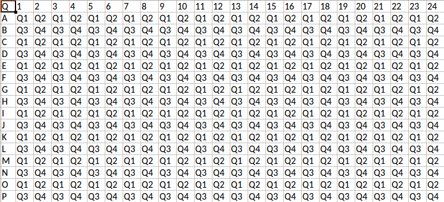

# Introduction to MTP

This package is for working with data on [micro plates](https://en.wikipedia.org/wiki/Microplate).

## Discovering functions

No functions are exported, but just type `MTP.` and hit "Tab" to get a list of methods.

## Generating a plate

Plates are [DataFrames](https://dataframes.juliadata.org/stable/).
Plates has a `geometry` which is the number of wells.
Currently supported are 96 and 384 well plates.

You create a plate by calling `MTP.plate("Platename")`:

```{julia}
julia> MTP.plate("P1")
96×3 DataFrame
 Row │ platename  geometry  well
     │ String     Int64     String 
─────┼─────────────────────────────
   1 │ P1               96  A01
   2 │ P1               96  B01
   3 │ P1               96  C01
   4 │ P1               96  D01
   5 │ P1               96  E01
   6 │ P1               96  F01
   7 │ P1               96  G01
   8 │ P1               96  H01
   9 │ P1               96  A02
  10 │ P1               96  B02
  11 │ P1               96  C02
  ⋮  │     ⋮         ⋮        ⋮
  86 │ P1               96  F11
  87 │ P1               96  G11
  88 │ P1               96  H11
  89 │ P1               96  A12
  90 │ P1               96  B12
  91 │ P1               96  C12
  92 │ P1               96  D12
  93 │ P1               96  E12
  94 │ P1               96  F12
  95 │ P1               96  G12
  96 │ P1               96  H12
                    74 rows omitted
```

You can make multiple plates by giving a vector of plate-names, and you can specify the geometry:

```{julia}
julia> MTP.plate(["P1", "P2"], 384)
768×3 DataFrame
 Row │ platename  geometry  well   
     │ String     Int64     String 
─────┼─────────────────────────────
   1 │ P1              384  A01
   2 │ P1              384  B01
   3 │ P1              384  C01
   4 │ P1              384  D01
   5 │ P1              384  E01
   6 │ P1              384  F01
   7 │ P1              384  G01
   8 │ P1              384  H01
   9 │ P1              384  I01
  10 │ P1              384  J01
  11 │ P1              384  K01
  ⋮  │     ⋮         ⋮        ⋮
 758 │ P2              384  F24
 759 │ P2              384  G24
 760 │ P2              384  H24
 761 │ P2              384  I24
 762 │ P2              384  J24
 763 │ P2              384  K24
 764 │ P2              384  L24
 765 │ P2              384  M24
 766 │ P2              384  N24
 767 │ P2              384  O24
 768 │ P2              384  P24
                   746 rows omitted
```

# Merging 96 well plate on 384 well plates

Often samples start out in 96 well format, and are merged into 384 well format for assay or storage.
To keep track of this, we use so called "quadrants" organized in a "Z":

| Q1 | Q2 |
| --- | --- |
| Q3 | Q4 |

Below, we show which quadrant each well of a 384 plate belongs to:



The `MTP.merge_info` function adds quadarant information and other usefull information to a plate DataFrame:

* `Q` (Q1, Q2, Q3, Q4): The quadrant of the well
* `well96`: The well on the source 96 well plate
* `well384`: The well on the 384 well plate to be explicit
* `col96`: The column on the 96 well plate. Useful for sorting
* `col384`: The column on the 384 well plate. Useful for sorting
* `row96` (Int): The row on the 96 well plate. Useful for sorting
* `row384` (Int): The row on the 384 well plate. Useful for sorting

```{julia}
julia> su2 = MTP.platesetupfile("../../test/plate_test_3.xlsx");
julia> s3 = @where(su2, :platename .== "384");
julia> first(s3, 5)
5×6 DataFrame
 Row │ platename  geometry  well    well_content  sheetname  filename          
     │ String     Int64     String  Any           String     String            
─────┼─────────────────────────────────────────────────────────────────────────
   1 │ 384             384  A01     A1            Ark2       plate_test_3.xlsx
   2 │ 384             384  B01     B1            Ark2       plate_test_3.xlsx
   3 │ 384             384  C01     C1            Ark2       plate_test_3.xlsx
   4 │ 384             384  D01     D1            Ark2       plate_test_3.xlsx
   5 │ 384             384  E01     E1            Ark2       plate_test_3.xlsx
julia> s4 = MTP.merge_info(s3);
julia> first(s4, 5)
5×13 DataFrame
 Row │ platename  geometry  well    well_content  sheetname  filename           Q       well96  well384  row96  col96  row384  col384 
     │ String     Int64     String  Any           String     String             String  String  String   Int64  Int64  Int64   Int64  
─────┼────────────────────────────────────────────────────────────────────────────────────────────────────────────────────────────────
   1 │ 384             384  A01     A1            Ark2       plate_test_3.xlsx  Q1      A01     A01          1      1       1       1
   2 │ 384             384  B01     B1            Ark2       plate_test_3.xlsx  Q3      A01     B01          1      1       2       1
   3 │ 384             384  C01     C1            Ark2       plate_test_3.xlsx  Q1      B01     C01          2      1       3       1
   4 │ 384             384  D01     D1            Ark2       plate_test_3.xlsx  Q3      B01     D01          2      1       4       1
   5 │ 384             384  E01     E1            Ark2       plate_test_3.xlsx  Q1      C01     E01          3      1       5       1
```

# Back to plate format

It is convenient to work with plate data in a "tall" DataFrame.
We saw that it is convenient to enter data about plates in plate format and ingest it using `platesetupfile`.
Similarly, we need to display the content in plate format to easily overview it.


For this we have the `MTP.printplate` function.
It takes 2 arguments: a plate DataFrame and the column to display.
The result is again a DataFrame, as`printplate` is just a thin wrapper around `unstack`.

Below we show how to get the Q information on the plate:


```{julia}
julia> MTP.printplate(s4,:Q)
16×26 DataFrame
 Row │ platename  row     1        2        3        4        5        6        7        8         ⋯
     │ String     String  String?  String?  String?  String?  String?  String?  String?  String?   ⋯
─────┼──────────────────────────────────────────────────────────────────────────────────────────────
   1 │ 384        A       Q1       Q2       Q1       Q2       Q1       Q2       Q1       Q2        ⋯
   2 │ 384        B       Q3       Q4       Q3       Q4       Q3       Q4       Q3       Q4
   3 │ 384        C       Q1       Q2       Q1       Q2       Q1       Q2       Q1       Q2
   4 │ 384        D       Q3       Q4       Q3       Q4       Q3       Q4       Q3       Q4
   5 │ 384        E       Q1       Q2       Q1       Q2       Q1       Q2       Q1       Q2        ⋯
   6 │ 384        F       Q3       Q4       Q3       Q4       Q3       Q4       Q3       Q4
   7 │ 384        G       Q1       Q2       Q1       Q2       Q1       Q2       Q1       Q2
   8 │ 384        H       Q3       Q4       Q3       Q4       Q3       Q4       Q3       Q4
   9 │ 384        I       Q1       Q2       Q1       Q2       Q1       Q2       Q1       Q2        ⋯
  10 │ 384        J       Q3       Q4       Q3       Q4       Q3       Q4       Q3       Q4
  11 │ 384        K       Q1       Q2       Q1       Q2       Q1       Q2       Q1       Q2
  12 │ 384        L       Q3       Q4       Q3       Q4       Q3       Q4       Q3       Q4
  13 │ 384        M       Q1       Q2       Q1       Q2       Q1       Q2       Q1       Q2        ⋯
  14 │ 384        N       Q3       Q4       Q3       Q4       Q3       Q4       Q3       Q4
  15 │ 384        O       Q1       Q2       Q1       Q2       Q1       Q2       Q1       Q2
  16 │ 384        P       Q3       Q4       Q3       Q4       Q3       Q4       Q3       Q4
                                                                                  16 columns omitted
```

