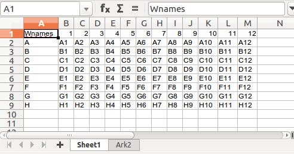
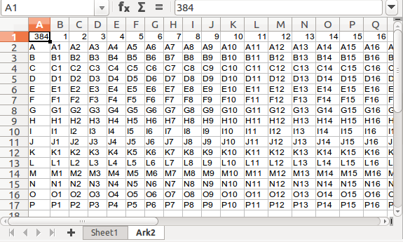

# Plate setup files

When working with plates, we need to easily describe to content of the plates.
This can often contain may parameters.

Using the `platesetupfile` function, we can describe the setup in convenient plate-format.
There can be one such plate in each sheet in the workbook.
In this way, we can describe many parameters in a single workbook.

## Example

The notebook `plate_test_3.xlsx` contains 2 sheets: one with a 96-well based setup and one with a 384 well based setup.





We can read this in to a dataframe like this:

```{julia}
julia> MicroPlates.platesetupfile("plate_test_3.xlsx")
480×6 DataFrame
 Row │ platename  geometry  well    well_content  sheetname  filename          
     │ String     Int64     String  Any           String     String            
─────┼─────────────────────────────────────────────────────────────────────────
   1 │ Wnames           96  A01     A1            Sheet1     plate_test_3.xlsx
   2 │ Wnames           96  B01     B1            Sheet1     plate_test_3.xlsx
   3 │ Wnames           96  C01     C1            Sheet1     plate_test_3.xlsx
   4 │ Wnames           96  D01     D1            Sheet1     plate_test_3.xlsx
   5 │ Wnames           96  E01     E1            Sheet1     plate_test_3.xlsx
   6 │ Wnames           96  F01     F1            Sheet1     plate_test_3.xlsx
   7 │ Wnames           96  G01     G1            Sheet1     plate_test_3.xlsx
   8 │ Wnames           96  H01     H1            Sheet1     plate_test_3.xlsx
   9 │ Wnames           96  A02     A2            Sheet1     plate_test_3.xlsx
  10 │ Wnames           96  B02     B2            Sheet1     plate_test_3.xlsx
  11 │ Wnames           96  C02     C2            Sheet1     plate_test_3.xlsx
  ⋮  │     ⋮         ⋮        ⋮          ⋮            ⋮              ⋮
 470 │ 384             384  F24     F24           Ark2       plate_test_3.xlsx
 471 │ 384             384  G24     G24           Ark2       plate_test_3.xlsx
 472 │ 384             384  H24     H24           Ark2       plate_test_3.xlsx
 473 │ 384             384  I24     I24           Ark2       plate_test_3.xlsx
 474 │ 384             384  J24     J24           Ark2       plate_test_3.xlsx
 475 │ 384             384  K24     K24           Ark2       plate_test_3.xlsx
 476 │ 384             384  L24     L24           Ark2       plate_test_3.xlsx
 477 │ 384             384  M24     M24           Ark2       plate_test_3.xlsx
 478 │ 384             384  N24     N24           Ark2       plate_test_3.xlsx
 479 │ 384             384  O24     O24           Ark2       plate_test_3.xlsx
 480 │ 384             384  P24     P24           Ark2       plate_test_3.xlsx
                                                               458 rows omitted
```

